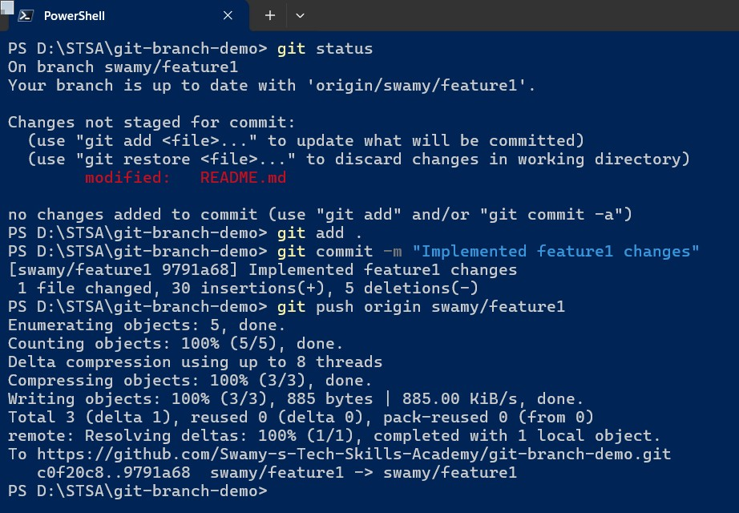

# GitHub Branchig Demo

I am learning git-branch-demo

## 1. Create the Repository and Clone it locally

> 1. Log in to GitHub and click the **New Repository** button.
> 1. Set the repository name, description, and choose **main** as the default branch.
> 1. Clone the new repository locally:

```powershell
    git clone <repo-url>
    cd <repo-folder>
```

## 2. Set Up the Main Branch

> 1. Ensure your local **main** branch is up to date:

```powershell
git checkout main
git pull origin main
```

## 3. Create and Set Up **swamy/feature1**

<<<<<<< HEAD
### 3.1. Create the Feature Branch from main

```powershell
git checkout -b swamy/feature1 main
git push -u origin swamy/feature1
```

### 3.2. Work on Feature1

> 1. Make changes to your code.
> 1. Stage and commit your changes:

```powershell
    git status
    git add .
    git commit -m "Implemented feature1 changes"
    git push origin swamy/feature1
```



### 3.3. Keep Feature1 Aligned with Main (Rebase)

> 1. When new commits are added to **main** (e.g., through merging PRs), update your feature branch by rebasing:

```powershell
  git checkout swamy/feature1
  git fetch origin
  git rebase origin/main
  git push --force-with-lease
```

> 1. This repositions **swamy/feature1** on top of the latest **main** commit, ensuring it always shows “0 behind main.”
=======
- **Create the Feature Branch from main:**

  ```sh
  git checkout -b swamy/feature1 main
  git push -u origin swamy/feature1
  ```
>>>>>>> c0f20c8 (Update README.md)
